# Ecowal-Presentation   
Hello, this repository describes the technical features of Ecowal and contains no code.

Ecowal is a user-friendly and efficient budget management app, developed with Flutter, to help you track and manage your expenses and income seamlessly. This app integrates various advanced technologies to offer smooth functionality and secure data storage, analytics, and user engagement. Below is a comprehensive overview of Ecowal’s features, technologies, and download links.

## Table of Contents
- [Mockups](#mockups)
- [Downloads & Video Links](#downloads--video-links)
- [Technologies Used](#technologies-used)
- [Project Structure](#project-structure)
- [Directory Explanation](#directory-explanation)
- [Several Screenshots](#several-screenshots)

## Mockups

<p>
  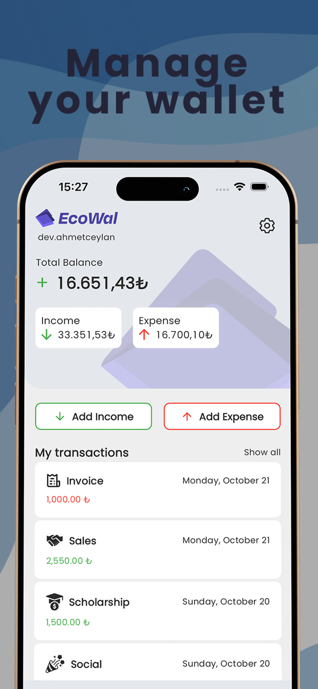
  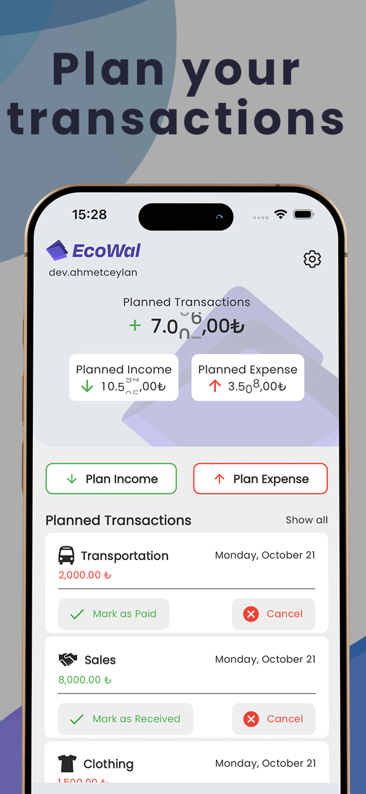
  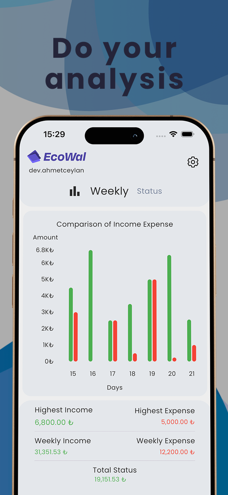
  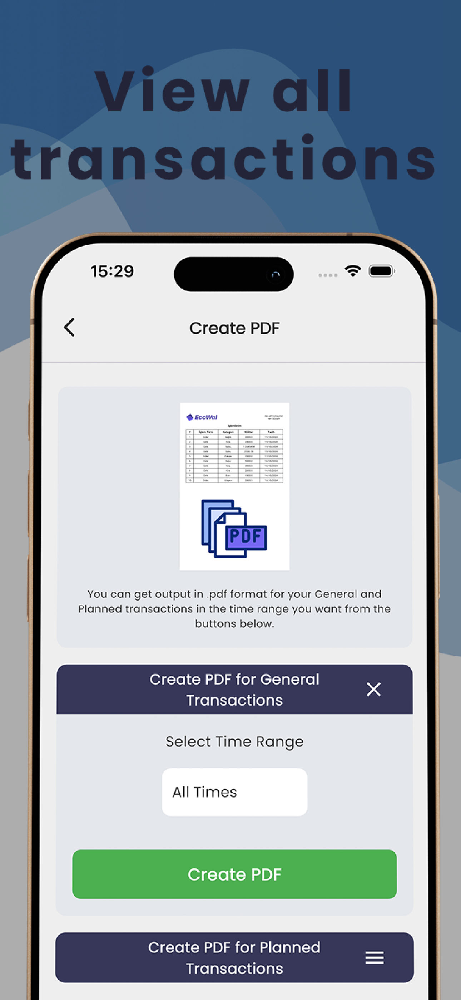
</p> 

## Downloads & Video Links 

<table>
  <tr>
    <td>
      <a href="https://apps.apple.com/tr/app/ecowal/id6736713811?l=tr">
        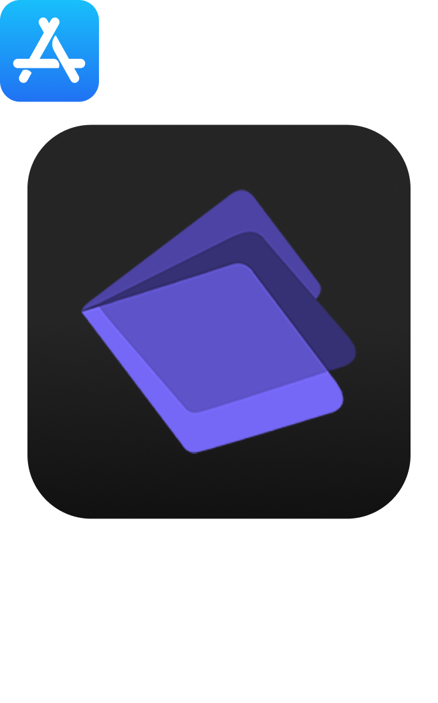
      </a>
    </td>
    <td>
      <a href="https://play.google.com/store/apps/details?id=com.ahmetceylan.ecowal&pli=1">
        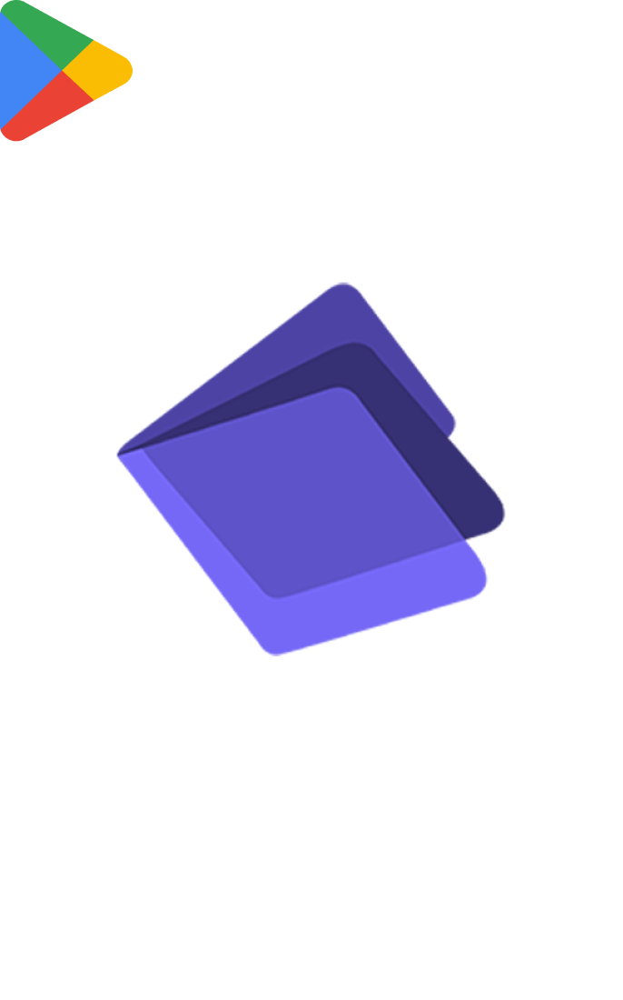
      </a>
    </td>
    <td>
      <a href="https://www.youtube.com/watch?v=unOZz5CLs-0">
        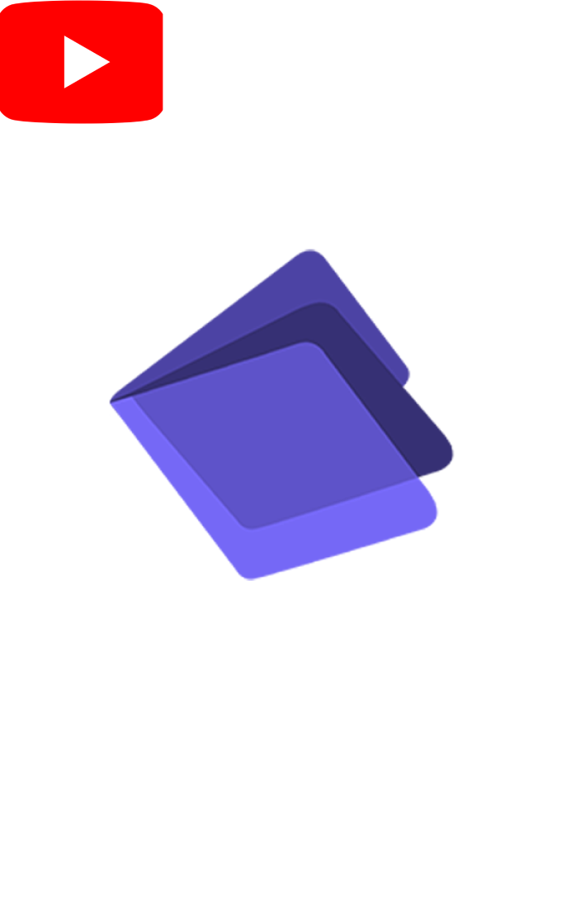
      </a>
    </td>
  </tr>
</table>

## Technologies Used

| Technology                | Purpose                                                                                         |
|---------------------------|-------------------------------------------------------------------------------------------------|
| **Firebase Authentication**  | Handles secure user authentication and login flows.                                           |
| **Firebase Cloud Firestore** | Cloud-based NoSQL database for secure, real-time data storage and sync.                       |
| **Firebase Remote Config**   | Configures app parameters remotely, enabling real-time adjustments without app updates.       |
| **Firebase Analytics**       | Gathers user behavior data, providing insights for enhancing the app experience.              |
| **Firebase Crashlytics**     | Tracks crashes in real-time, allowing prompt issue resolution and improved stability.         |
| **Google AdMob**             | Displays ads, supporting monetization.                                                        |
| **Google Sign-In**           | Simplifies sign-in with Google credentials.                                                   |
| **Apple Sign-In**            | Simplifies sign-in with Apple credentials.                                                    |
| **Provider**                 | Manages state efficiently throughout the app.                                                 |
| **GetX**                     | Facilitates fast and easy state management.                                                   |
| **GetIt**                    | Implements dependency injection for better app architecture.                                  |
| **Localizations**            | Provides multi-language support for a global user base.                                       |
| **Path Provider**            | Accesses commonly used directories for persistent storage.                                    |
| **Pdf**                      | Enables PDF creation and export of user data.                                                |
| **Open File**                | Allows viewing of files within the app.                                                      |
| **Lottie**                   | Integrates engaging animations to enhance UI/UX.                                             |
| **Flutter SVG**              | Renders SVG images for high-quality icons and vector graphics.                               |
| **Fl Chart**                 | Displays financial data through interactive and informative charts.                           |

## Project Structure

The Ecowal project is organized in a modular and scalable manner, ensuring ease of maintenance and code readability. Below is an overview of the directory structure, which highlights the core components, shared utilities, and feature-based folders. 
```bash
lib/
├── core/
│   ├── application/
│   ├── constant/
│   ├── routes/
│   ├── styles/
│   ├── theme/
│   └── dimensions.dart
├── datasource/
│   ├── models/
│   ├── repository/
│   ├── services/
│   └── viewmodel/
├── shared/
│   ├── buttons/
│   ├── components/
│   ├── formFields/
│   ├── scaffolds/
│   └── utils/
│       ├── firebase_options.dart
│       └── locator.dart
├── features/
│   ├── auth/
│   ├── general/
│   ├── graphs/
│   ├── settings/
└── main.dart
```

## Directory Explanation

- **core/**: Contains the essential configurations, routes, themes, and constants.
- **datasource/**: Handles data sources, including models, repositories, services, and view models.
- **shared/**: Reusable UI components, utilities, and widgets across the project.
- **features/**: Implements feature-specific modules for handling business logic, such as authentication, transactions, profile management, etc.
- **main.dart**: Entry point of the Flutter application.

This structure ensures separation of concerns and clean architecture, making the project easy to extend and maintain as it grows.

## Several Screenshots

<p>
 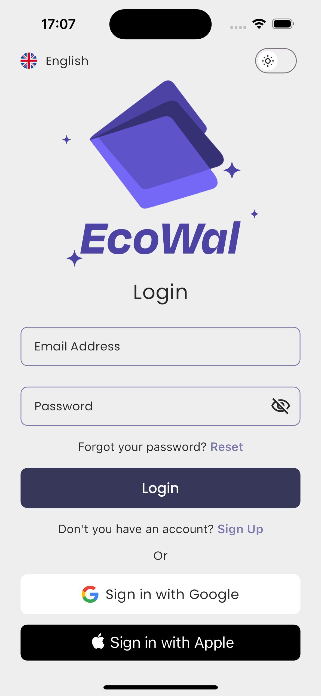
  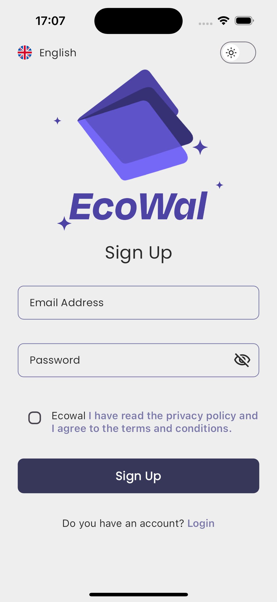
  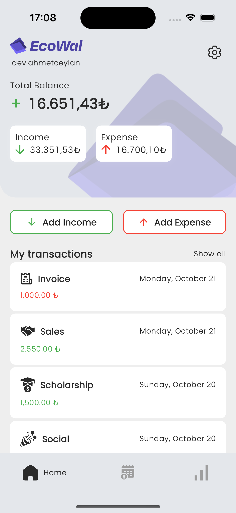
  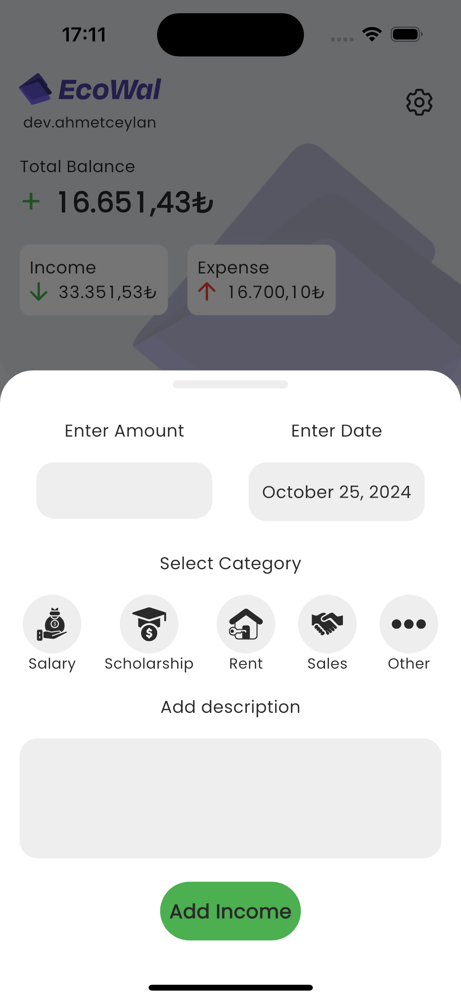
  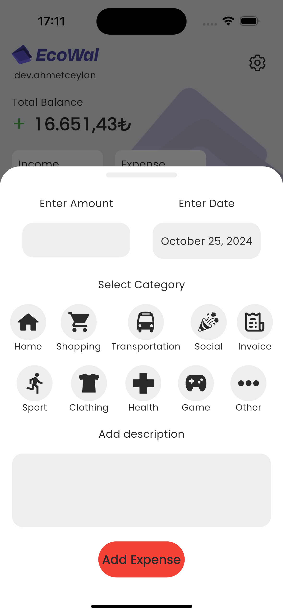
  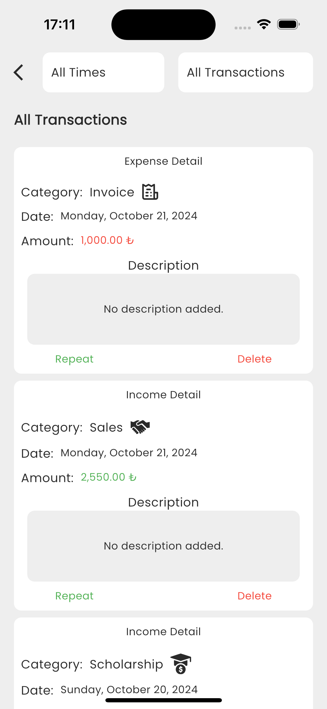
  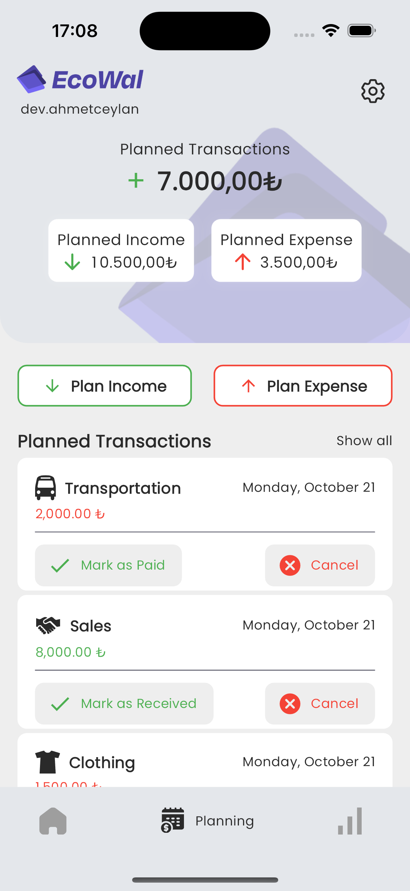
  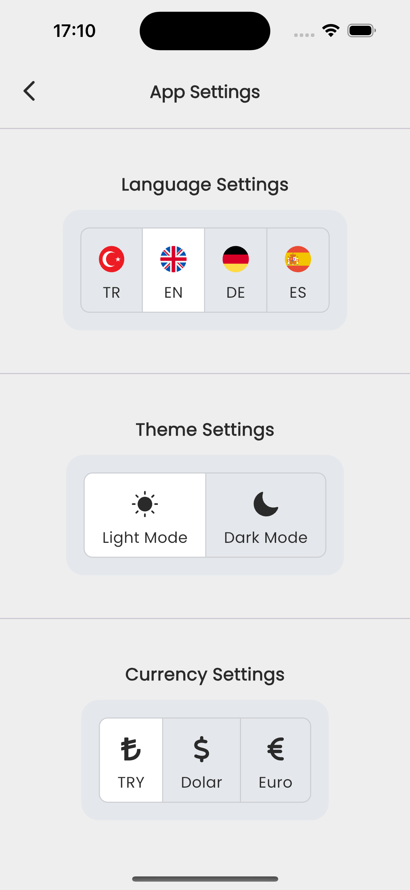
</p>
